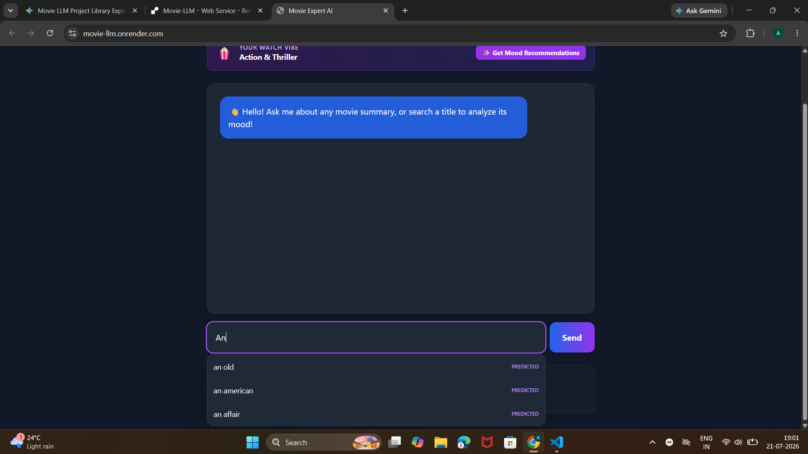
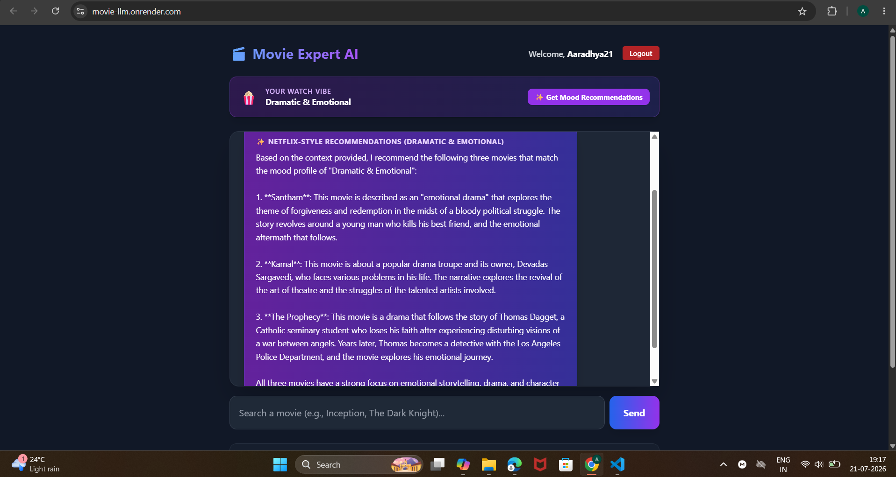

# 🎬 Movie LLM (Groq Hybrid Edition)

[](https://movie-llm.onrender.com)

An **AI-powered Movie Expert App** featuring a **Hybrid RAG Architecture** that combines embeddings with cloud-based LLM inference to bypass API rate limits and model deprecation issues.

---

## 💡 Problem Statement
Standard LLM wrappers often suffer from strict API rate limits and high latency when searching through large, custom datasets. Movie LLM solves this by using Cohere embeddings for highly accurate vector search, while offloading the heavy text generation to Groq's ultra-fast LLaMA-3.1 model.

---

## 🚀 Key Features & Architecture
**Data Flow:** `PDF Documents (A-Z)` ➔ `Text Splitter` ➔ `Cohere Embeddings` ➔ `FAISS Vector Store` ➔ `Flask Backend` ➔ `Groq LLaMA-3.1 Inference` ➔ `HTML/Tailwind UI`

* **Hybrid RAG Engine:** Leverages Cohere embeddings for high-quality semantic search and Groq for high-speed generation.
* **Cached Vector Store:** Eliminates the need to rebuild embeddings on every reload, ensuring rapid application start times.
* **Scalable Document Ingestion:** Capable of loading and processing massive movie datasets split across multiple PDF files.
* **Cloud & Local Flexibility:** Designed to run seamlessly in a local environment or deployed via Render.
* **Dynamic N-Gram Autocomplete:** Trains a custom Bigram model dynamically on the FAISS vector vocabulary for real-time, context-aware search predictions.
* **Sentiment & Mood Extraction:** Prompts Groq's LLaMA-3.1 to return strict JSON responses, extracting concise movie summaries alongside 1-to-3 word mood classifications.
* **Netflix-Style Recommendations:** Tracks a user's dominant watch vibe via PostgreSQL and queries the vector store to suggest new movies matching their specific emotional profile.
* **Persistent User Database:** Implements a full PostgreSQL authentication system with Flask-Login to safely store user credentials and search history.

---

## 📸 Screenshots

### Login


### Signup


### Dynamic N-Gram Autocomplete


### Netflix-Style Mood Recommendations


### Model Output & Chat Interface


---

## 🛠️ Tech Stack
* **Language:** Python 3.12+
* **LLM & Inference:** Groq (`llama-3.1-8b-instant`), LLaMA-3.1
* **RAG Framework:** LangChain, Cohere Embeddings, FAISS
* **Frontend & Backend:** Flask, HTML, Tailwind CSS, JavaScript
* **Database & Deployment:** PostgreSQL, SQLAlchemy, Render

---

## ⚙️ Local Setup & Run

It is recommended to run this project in a virtual environment using **Python 3.12.x**.

```bash
# 1. Clone the repository
git clone [https://github.com/AaradhyaNikam/Movie-LLM.git](https://github.com/AaradhyaNikam/Movie-LLM.git)
cd Movie-LLM

# 2. Create and activate a virtual environment
python -m venv venv
source venv/bin/activate   # On Windows use: venv\Scripts\activate

# 3. Install dependencies
pip install -r requirements.txt

# 4. Launch the application
python app.py
---

👨‍💻 Author
Aaradhya Aashish Nikam 3rd-Year B.Tech Student, D.Y. Patil Engineering College, Pune * LinkedIn: www.linkedin.com/in/aaradhya-nikam-02a69b32a

Email: nikamaaradhya97@gmail.com
