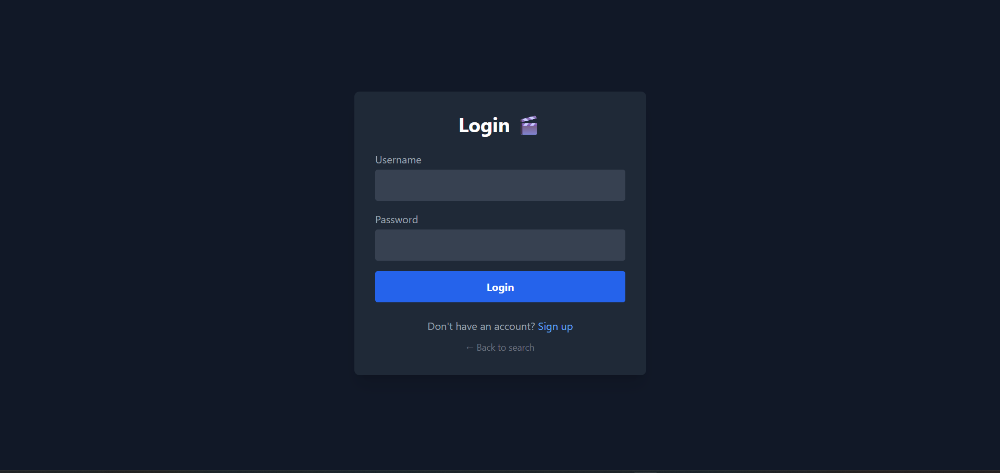
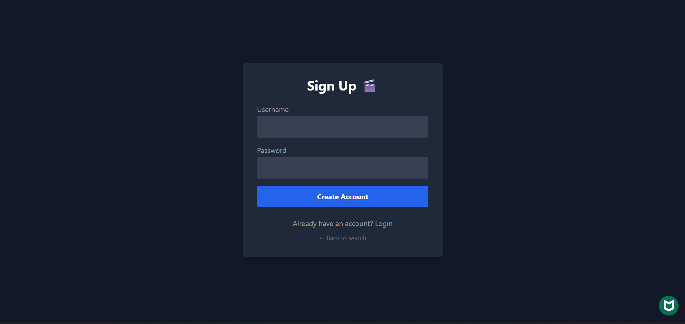
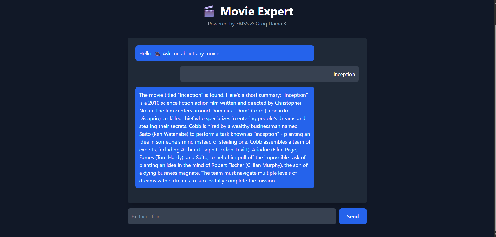

# 🎬 Movie Bot (Groq Hybrid Edition)

An **AI-powered Movie Expert App** featuring a **Hybrid RAG Architecture** that combines local embeddings with cloud-based LLM inference to bypass API rate limits and model deprecation issues.

---

## 💡 Problem Statement
Standard LLM wrappers often suffer from strict API rate limits and high latency when searching through large, custom datasets. Movie Bot solves this by using local, CPU-based embeddings for unlimited, free vector search, while offloading the heavy text generation to Groq's ultra-fast LLaMA-3.1 model. 

---

## 🚀 Key Features & Architecture
**Data Flow:** `PDF Documents (A-Z)` ➔ `Text Splitter` ➔ `HuggingFace Local Embeddings` ➔ `FAISS Vector Store` ➔ `Groq LLaMA-3.1 Inference` ➔ `Streamlit UI`

* **Hybrid RAG Engine:** Leverages local HuggingFace embeddings (`all-MiniLM-L6-v2`) for cost-free search and Groq for high-speed generation.
* **Cached Vector Store:** Eliminates the need to rebuild embeddings on every reload, ensuring rapid application start times.
* **Scalable Document Ingestion:** Capable of loading and processing massive movie datasets split across multiple PDF files.
* **Cloud & Local Flexibility:** Designed to run seamlessly in a local environment or deployed via Render.

---

## 📸 Screenshots

### Login

### Signup

### Model Output & Chat Interface

---

## 🛠️ Tech Stack
**Language:** Python 3.12+  
**LLM & Inference:** Groq (`llama-3.1-8b-instant`), LLaMA-3.1  
**RAG Framework:** LangChain, HuggingFace, FAISS  
**Frontend & Deployment:** Streamlit, Render  

---

## ⚙️ Local Setup & Run

It is recommended to run this project in a virtual environment using **Python 3.12.x**.

bash
# 1. Clone the repository
git clone [https://github.com/AaradhyaNikam/movie-bot.git](https://github.com/AaradhyaNikam/movie-bot.git)
cd movie-bot

# 2. Create and activate a virtual environment
python -m venv venv
source venv/bin/activate   # On Windows use: venv\Scripts\activate

# 3. Install dependencies
pip install -r requirements.txt

# 4. Launch the application
streamlit run app.py

---

👨‍💻 Author
Aaradhya Aashish Nikam 2nd-Year B.Tech Student, D.Y. Patil Engineering College, Pune * LinkedIn: www.linkedin.com/in/aaradhya-nikam-02a69b32a

Email: nikamaaradhya97@gmail.com
